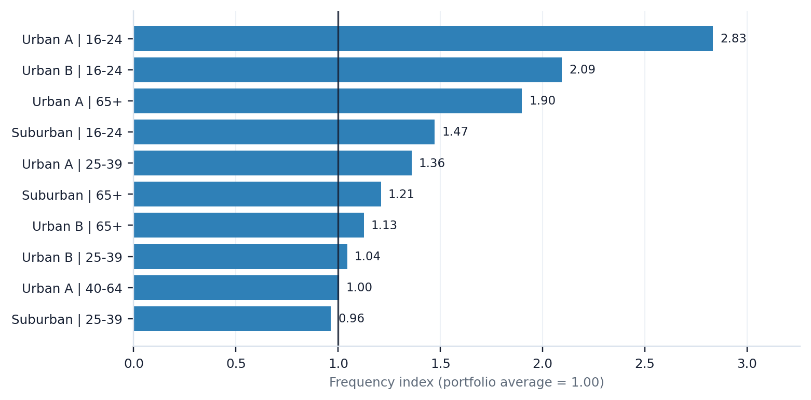
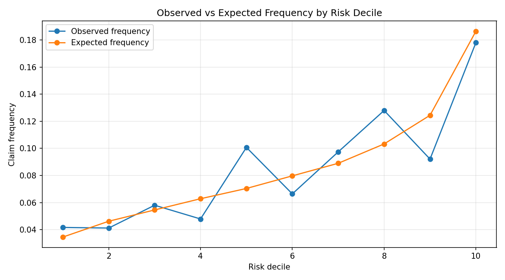

# P&C Pricing Diagnostic — Sample One-Pager

## What this is

A compact actuarial analytics diagnostic for P&C insurance teams that want to identify pricing, underwriting, and portfolio monitoring issues before committing to a full pricing review.

This sample uses synthetic personal auto data to demonstrate the workflow. The same structure can be adapted to real policy, premium, exposure, claim, and underwriting data.

## Business question

Which segments appear to require pricing, underwriting, or data quality review, and is there enough technical support to prioritize the next action?

## What the diagnostic reviews

The diagnostic combines four layers:

1. Portfolio experience review by segment.
2. Exploratory frequency analysis.
3. Benchmark Poisson frequency GLM with exposure offset.
4. Model validation and executive visual outputs.

The goal is not to produce final rate indications immediately. The goal is to identify where a deeper pricing or underwriting review is most likely to create value.

## Sample outputs

### Elevated frequency segments

The frequency index compares each segment's observed claim frequency against the portfolio average.

A value above 1.00 indicates higher frequency than the portfolio average.

### Model calibration view

The observed-versus-expected chart compares actual claim frequency against model-expected frequency by risk decile.

This helps assess whether the benchmark model is directionally capturing risk differences.

## What this can help answer

- Which segments show elevated claim frequency?
- Which segments show elevated loss ratio pressure?
- Are observed and expected claim counts reasonably aligned?
- Is there evidence of model instability or calibration issues?
- Which areas should be prioritized for pricing, underwriting, or data quality review?

## Typical deliverables

- Executive summary memo.
- Segment-level experience tables.
- Frequency and loss ratio diagnostic tables.
- Observed-versus-expected model outputs.
- Model validation summary.
- Excel review pack.
- Technical appendix if needed.

## Intended users

This diagnostic is designed for:

- pricing actuaries;
- pricing managers;
- underwriting managers;
- insurance analytics teams;
- MGAs and program administrators;
- consultants reviewing book performance.

## What this is not

This is not a final rate filing, final pricing indication, or replacement for actuarial judgment.

A production engagement would require validation of real source data, business rules, exposure definitions, premium treatment, claim handling, credibility, expenses, reinsurance, regulatory constraints, and implementation feasibility.

## Suggested next step

Use the sample diagnostic structure to review one book, program, territory cluster, or segment group.

The first practical objective would be to identify 3–5 pricing or underwriting review priorities supported by data, model diagnostics, and business interpretation.