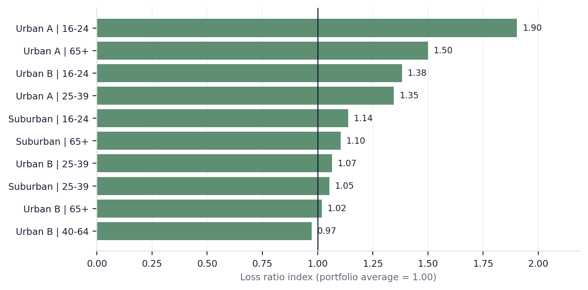
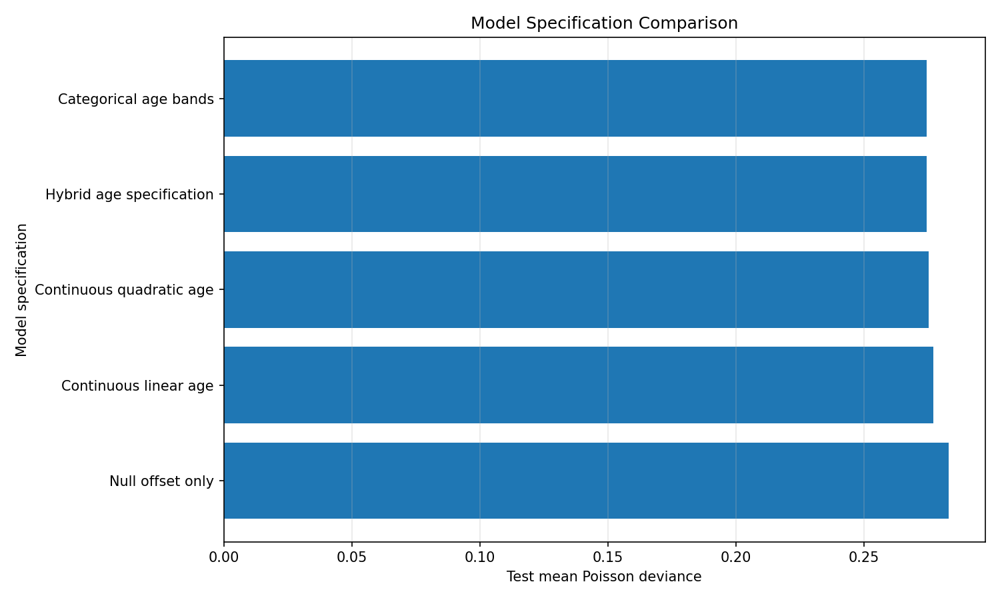

# Sample Executive Memo: P&C Pricing Diagnostic

## 1. Executive summary

This sample diagnostic reviews a synthetic personal auto insurance portfolio to identify segments that may require pricing, underwriting, or data quality review.

The analysis combines portfolio experience review, exploratory frequency diagnostics, a benchmark Poisson frequency GLM, model specification comparison, and model validation outputs. The objective is not to produce final pricing indications, but to demonstrate a repeatable workflow for identifying actionable pricing concerns.

The main outputs are:

- segment-level frequency and loss ratio diagnostics;
- benchmark frequency model results;
- observed-versus-expected claim comparisons;
- calibration diagnostics by expected-risk decile;
- executive visuals for pricing and underwriting review.

## 2. Scope of analysis

The diagnostic focuses on claim frequency and basic premium adequacy indicators.

The core response variable is `claim_count`, modeled using earned exposure and policy-level risk characteristics. The analysis also uses `total_claim_amount` and `earned_premium` to calculate loss ratio indicators by segment.

The benchmark model is a Poisson GLM for claim counts with a log exposure offset. The model estimates expected claim counts for each policy-period and supports observed-versus-expected analysis across segments.

This sample uses synthetic data. In a real engagement, the same workflow would require validation of source data, exposure definitions, premium fields, claim transaction logic, and business rules before producing recommendations.

## 3. Key findings

### 3.1 Segments with elevated claim frequency

The frequency index compares each segment's observed claim frequency against the total portfolio average.

A frequency index above 1.00 means the segment has higher observed frequency than the portfolio average. For example, a frequency index of 1.50 means the observed claim frequency is 50% higher than the portfolio average.

The highest-frequency segments should not be repriced automatically. They should first be reviewed for credibility, exposure volume, claim count, underwriting rules, and potential data quality issues.


### 3.2 Segments with elevated loss ratio

The loss ratio is defined as:

```text
loss ratio = total claim amount / earned premium
```

The loss ratio index compares a segment's loss ratio against the total portfolio loss ratio.

A loss ratio index above 1.00 indicates that the segment's loss ratio is higher than the portfolio average. This can point to premium inadequacy, worse claim severity, worse claim frequency, or a mix issue.

This diagnostic is not a complete profitability measure because it does not include expenses, commissions, reinsurance, cost of capital, or target underwriting margin.



## 4. Benchmark frequency model

The benchmark frequency model estimates expected claim counts using a Poisson GLM with a log exposure offset.

The benchmark model is intended to provide a transparent first-pass pricing view. It is not intended to be the final production pricing model.

The model supports:

- expected claim count estimation by policy-period;
- observed-versus-expected analysis by segment;
- calibration review by expected-risk decile;
- comparison against alternative model specifications.

## 5. Model validation summary

### 5.1 Calibration by expected-risk decile

The calibration chart compares observed and expected frequency across expected-risk deciles.

This is a key validation view because it checks whether groups assigned higher expected risk by the model also show higher observed frequency.


A reasonably calibrated benchmark should show observed and expected frequencies moving together across risk deciles. Material and persistent deviations may indicate omitted variables, model misspecification, credibility issues, or pricing segmentation opportunities.

### 5.2 Model specification comparison

Alternative frequency model specifications were compared using held-out test mean Poisson deviance.

Lower test mean deviance indicates better out-of-sample performance under Poisson deviance loss.



This comparison supports the choice of a benchmark specification, but it should not be interpreted mechanically. Business interpretability, stability, credibility, and implementation constraints also matter.

## 6. Recommended next steps

Based on this diagnostic structure, a real portfolio review would typically continue with the following steps:

1. Validate source data definitions for exposure, premium, claim count, and claim amount.
2. Review high-frequency and high-loss-ratio segments with underwriting and pricing teams.
3. Separate frequency and severity drivers before recommending rate action.
4. Test whether additional variables improve model calibration and business interpretation.
5. Review overdispersion and consider quasi-Poisson, negative binomial, or richer model structures if needed.
6. Convert model findings into indicated pricing actions, underwriting rules, monitoring dashboards, or data quality remediation.

## 7. Limitations

This sample diagnostic uses synthetic data and should be interpreted as a portfolio analytics demonstration, not as a final actuarial pricing indication.

The analysis does not include:

- final rate indications;
- severity modeling;
- expense provisions;
- reinsurance effects;
- credibility weighting for pricing implementation;
- regulatory constraints;
- competitive positioning;
- underwriting judgment;
- temporal trend analysis.

A production pricing review would require real policy, premium, claim, exposure, and underwriting data, along with business validation from the carrier or program manager.

## 8. Deliverables produced

The repository produces the following sample output families:

```text
outputs/tables/
outputs/figures/
outputs/excel/
reports/
```

The current diagnostic includes:

- portfolio overview tables;
- segment experience tables;
- exploratory frequency diagnostics;
- benchmark frequency model outputs;
- model specification comparison;
- model diagnostic outputs;
- executive visual pack;
- this executive memo.

## 9. Commercial positioning

This diagnostic is designed as an entry-point actuarial analytics service for P&C insurance teams that need a structured review of pricing segmentation, claim frequency behavior, model calibration, and portfolio monitoring priorities.

The intended users are:

- pricing actuaries;
- pricing managers;
- underwriting managers;
- insurance analytics teams;
- MGAs and program administrators;
- consultants reviewing book performance.

The core business question is:

```text
Which segments appear to require pricing, underwriting, or data quality review, and is there enough technical support to prioritize the next action?
```